# Tax OCR System — Database Schema & System Flow

## Database Schema

### Core / Auth

#### tenants
| Column | Type | Notes |
|--------|------|-------|
| id | UUID | PK |
| name | VARCHAR(255) | ชื่อบริษัท |
| tax_id | VARCHAR(13) | เลขผู้เสียภาษี UNIQUE |
| status | VARCHAR(20) | active / inactive |
| created_at, updated_at | TIMESTAMPTZ | |

#### branches
| Column | Type | Notes |
|--------|------|-------|
| id | UUID | PK |
| tenant_id | UUID | FK → tenants |
| name, code | VARCHAR | UNIQUE(tenant_id, code) |
| status | VARCHAR(20) | active / inactive |

#### users
| Column | Type | Notes |
|--------|------|-------|
| id | UUID | PK |
| tenant_id | UUID | FK → tenants |
| name, email, phone | VARCHAR | |
| line_user_id | VARCHAR(100) | LINE User ID |
| role | VARCHAR(20) | admin / staff |
| password_hash | VARCHAR(255) | bcrypt |
| status | VARCHAR(20) | active / inactive |

#### user_branches
| Column | Type | Notes |
|--------|------|-------|
| user_id | UUID | FK → users |
| branch_id | UUID | FK → branches |

---

### Documents & Invoices

#### document_imports
| Column | Type | Notes |
|--------|------|-------|
| id | UUID | PK |
| tenant_id, branch_id, user_id | UUID | FK |
| source_type | VARCHAR(20) | camera/upload/zip/gdrive/onedrive |
| total_files, processed_files | INT | |
| status | VARCHAR(20) | pending/processing/done/failed |

#### invoices
| Column | Type | Notes |
|--------|------|-------|
| id | UUID | PK |
| tenant_id, branch_id | UUID | FK |
| document_import_id | UUID | FK nullable |
| file_path, file_hash | TEXT/VARCHAR(64) | MinIO path + SHA-256 |
| invoice_no | SERIAL | running number |
| invoice_doc_no, invoice_date | TEXT | จากใบกำกับจริง |
| doc_type | VARCHAR(50) | tax_invoice / receipt |
| vat_inclusive | BOOLEAN | ราคารวม VAT แล้ว? |
| vat_rate | DECIMAL(5,2) | default 7.00 |
| vendor_name, vendor_tax_id | VARCHAR | ข้อมูลผู้ขาย |
| vendor_address, vendor_branch_code | TEXT/VARCHAR | |
| buyer_name, buyer_tax_id | VARCHAR | ข้อมูลผู้ซื้อ |
| buyer_address, buyer_branch_code | TEXT/VARCHAR | |
| total_before_vat | NUMERIC(15,2) | ยอดก่อน VAT |
| vat_amount | NUMERIC(15,2) | ยอด VAT |
| total_amount | NUMERIC(15,2) | ยอดรวม |
| vat_exempt_amount | DECIMAL(15,2) | ยอดยกเว้น VAT |
| vat_inclusive_subtotal | DECIMAL(15,2) | มูลค่าที่มีภาษี |
| discount_amount | DECIMAL(15,2) | ส่วนลด |
| vat_math_ok | BOOLEAN | คำนวณ VAT ถูกต้อง |
| status | VARCHAR(20) | pending/verified/conflict |
| verified_by, verified_at | UUID/TIMESTAMPTZ | ผู้ verify |
| invoice_year, invoice_month, invoice_day | INT | วันที่บนเอกสาร (CE year) |
| accounting_year, accounting_month | INT | รอบบัญชีภาษี (ภพ.30) |
| duplicate_of | UUID | FK → invoices nullable |

#### invoice_items
| Column | Type | Notes |
|--------|------|-------|
| id | UUID | PK |
| invoice_id | UUID | FK → invoices CASCADE |
| description | TEXT | ชื่อรายการ |
| product_code, unit | VARCHAR | รหัสสินค้า, หน่วย |
| quantity | NUMERIC(15,4) | |
| unit_price, discount, total_price | NUMERIC(15,2) | |
| asset_type | VARCHAR(20) | asset / expense / pending |
| classified_by | VARCHAR(20) | rule / ai / human |

---

### Classification & HITL

#### classification_rules
| Column | Type | Notes |
|--------|------|-------|
| id | UUID | PK |
| tenant_id | UUID | FK |
| keyword | VARCHAR(255) | UNIQUE per tenant |
| asset_type | VARCHAR(20) | asset / expense |
| source | VARCHAR(20) | ai / human |
| confidence | NUMERIC(5,4) | 0.0 – 1.0 |

#### hitl_queue
| Column | Type | Notes |
|--------|------|-------|
| id | UUID | PK |
| tenant_id | UUID | FK |
| invoice_item_id | UUID | FK → invoice_items |
| reason | TEXT | classification_needed / ocr_mismatch |
| status | VARCHAR(20) | pending / resolved |
| resolved_by | UUID | FK → users nullable |

#### ocr_config
| Column | Type | Notes |
|--------|------|-------|
| provider | VARCHAR(50) | openai / gcv UNIQUE |
| api_key | TEXT | encrypted at rest |
| enabled | BOOLEAN | |

---

### Reviewer & Reward

#### reviewers
| Column | Type | Notes |
|--------|------|-------|
| id | UUID | PK |
| name | VARCHAR(255) | |
| line_user_id | VARCHAR(100) | UNIQUE |
| reviewer_type | VARCHAR(30) | text_verifier / classification_verifier |
| status | VARCHAR(20) | active / inactive |
| total_earned, pending_payout | NUMERIC(12,2) | ยอดสะสม |

#### reviewer_tasks
| Column | Type | Notes |
|--------|------|-------|
| hitl_queue_id | UUID | FK |
| reviewer_id | UUID | FK |
| task_type | VARCHAR(30) | text_verification / classification_verification |
| status | VARCHAR(20) | sent/accepted/completed/expired |
| reward_amount | NUMERIC(10,2) | |
| sent_at, accepted_at, completed_at, expired_at | TIMESTAMPTZ | |

#### reviewer_payouts
| Column | Type | Notes |
|--------|------|-------|
| reviewer_id | UUID | FK |
| amount | NUMERIC(12,2) | |
| method | VARCHAR(20) | promptpay / bank |
| account_number | VARCHAR(20) | |
| status | VARCHAR(20) | pending / paid |

#### reward_config
| Column | Type | Notes |
|--------|------|-------|
| task_type | VARCHAR(30) | UNIQUE |
| amount | NUMERIC(10,2) | text=5฿, classify=3฿ |
| currency | VARCHAR(3) | THB |

---

### Storage & Archive

#### tenant_storage_config
| Column | Type | Notes |
|--------|------|-------|
| tenant_id | UUID | FK UNIQUE |
| storage_type | VARCHAR(20) | gdrive / onedrive / both |
| gdrive_folder_id, gdrive_folder_url | TEXT | |
| onedrive_folder_id, onedrive_folder_url | TEXT | |
| owned_by | VARCHAR(20) | tenant / us |
| billing_type | VARCHAR(20) | included / charged |
| monthly_fee | NUMERIC(10,2) | |

#### archive_policies
| Column | Type | Notes |
|--------|------|-------|
| tenant_id | UUID | FK UNIQUE |
| active_days | INT | default 90 |
| archive_days | INT | default 365 |

#### archive_logs
| Column | Type | Notes |
|--------|------|-------|
| tenant_id | UUID | FK |
| entity_type | VARCHAR(50) | invoice / document_import |
| entity_id | UUID | |
| archive_path | TEXT | MinIO cold path |
| status | VARCHAR(20) | archived / restored |

---

### Conversation, LINE & Audit

#### conversations
| Column | Type | Notes |
|--------|------|-------|
| id | UUID | PK |
| tenant_id, branch_id | UUID | FK |
| user_id | UUID | FK nullable |
| channel | VARCHAR(20) | line_oa / liff |
| line_user_id | VARCHAR(100) | |
| status | VARCHAR(20) | open / closed |

#### messages
| Column | Type | Notes |
|--------|------|-------|
| conversation_id | UUID | FK CASCADE |
| sender_type | VARCHAR(20) | customer / admin / bot |
| message_type | VARCHAR(20) | text / image / file / sticker |
| content | TEXT | |
| metadata | JSONB | LINE message ID etc. |

#### audit_logs
| Column | Type | Notes |
|--------|------|-------|
| tenant_id, branch_id, user_id | UUID | FK |
| action | VARCHAR(50) | login/upload/submit/delete |
| entity_type | VARCHAR(50) | invoice / document_import … |
| entity_id | UUID | |
| metadata | JSONB | รายละเอียดเพิ่มเติม |
| ip_address, device_info | VARCHAR/TEXT | |

---

## System Flow

```mermaid
flowchart TD
    A["👤 ลูกค้า\nLIFF: camera / upload / zip / gdrive"] --> B

    subgraph API ["🌐 API Layer"]
      B["POST /documents/upload\n(document_handler.go)"]
      B --> B1["SSRF guard validateURL\n+ ตรวจ content-type"]
      B1 --> C["บันทึกไฟล์ → MinIO\n(storage.Upload)"]
      C --> D["สร้าง document_import + invoice\nstatus = pending"]
      D --> E["Enqueue\nAsynq: TypeProcessInvoice"]
    end

    E --> F

    subgraph WORKER ["⚙️ Background Worker (Asynq + Redis)"]
      F["Worker รับงาน\ndownload file จาก MinIO"]
      F --> G

      subgraph OCR ["🔍 Dual-Engine OCR (Sequential)"]
        G["1. Vision API\nextractText → Thai raw text\nclassifyFromText → doc_type, vat_inclusive"]
        G --> H["2. GPT-4o-mini\nรับ raw text + VISION HINT\nextract ทุก field"]
      end

      H --> I["crossVerify\nเปรียบ: vendor_tax_id\ntotal_before_vat, vat, total"]
      I --> J{"matched?"}
      J -- "✅ ตรง" --> K["status = verified"]
      J -- "❌ ไม่ตรง" --> L["status = conflict"]
      K & L --> M["UpdateInvoiceData\n→ PostgreSQL"]
    end

    M --> N

    subgraph CLASSIFY ["🏷️ Hybrid Classification (ทุก Line Item)"]
      N["วนแต่ละ line item"]
      N --> O1["1. DB Rules\n(tenant keyword match)"]
      O1 -- match --> P["classified_by = rule ✅"]
      O1 -- "no match" --> O2["2. Hardcoded Keywords"]
      O2 -- match --> P
      O2 -- "no match" --> O3["3. GPT classify\nconfidence?"]
      O3 -- "≥ 0.8" --> Q["classified_by = ai ✅\n+ สร้าง Rule ใหม่\n(self-learning)"]
      O3 -- "< 0.8" --> R["asset_type = pending"]
    end

    P & Q & R --> S["CreateInvoiceItem\n→ PostgreSQL"]
    S --> T{"ต้อง HITL?"}
    T -- "pending\nหรือ ocr_mismatch" --> U["CreateHitlItem\nhitl_queue"]
    T -- ไม่ --> V
    U --> U1["assignForHitl\nRound-robin → LINE Push\nส่งให้ reviewer"]
    U1 --> V["UpdateDocumentImport\nstatus = done"]
    V --> W["LINE Push แจ้งลูกค้า"]

    subgraph RESULT ["📬 ผลลัพธ์"]
      W --> X1["✅ verified\nยอดรวม N บาท\nรายการ N รายการ"]
      W --> X2["⚠️ conflict\nทีมงานจะตรวจสอบเพิ่มเติม"]
    end

    subgraph REVIEWER ["👥 Reviewer Flow"]
      U1 --> R1["Reviewer รับ LINE\ntext_verifier / classification_verifier"]
      R1 --> R2["ตรวจสอบ + ส่งคำตอบ"]
      R2 --> R3["บันทึกผล\n+ สะสม reward"]
      R3 --> R4["ถ้าไม่รับใน X นาที\n→ ส่งคนถัดไป"]
    end
```

---

*Tax OCR System — Generated June 2026*
